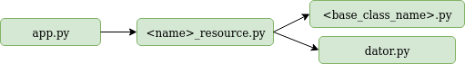

 # EventPost:
  

The goal is to achieve a fully deployed system while using and learning continuous and incremental integration, cloud services and agile procedures in projects. 
Further information about the project is available in the __[documentation](https://carlos-el.github.io/EventPost-CCProject/index).__

## Requirements and Usage:

- Previous requirements: 
    - `Docker`
    - `python 3.5 - 3.8`
- Install: 
    - `pip3 install invoke`
    - `invoke installDependencies`
- Build: 
    - `invoke buildContainers`
- Test: 
    - `invoke test`
    - `testContainers`
- Coverage: 
    - `invoke coverage`
- Run: 
    - `invoke runContainers`

## Development:
We have advanced in the development of our microservices. The [Events](https://github.com/carlos-el/EventPost-CCProject/tree/master/events_microservice) and [Notifications](https://github.com/carlos-el/EventPost-CCProject/tree/master/notifications_microservice) microservices have their main functionality implemented. It is possible to make CRUD operations over their resources using RESTful requests. For providing data to the resources we have created dators (actually mockers) that are injected into the resources.
Finally, new integration tests for the REST services have been created. More information about testing [here](/docs/index.md#testing).

Both microservices use a layered architecture.

## Docker

The base image choosen for the containers has been alpine. Its lighter than other common images allowing a fast development, test and deployment and also its quite popular so we can easily solve problems (we had to resolve some problems in invoke as the alpine shell is not bash but sh).

Performance measurement between different base images can be found [here](/docs/index.md#images).

We have until now 2 microservices so we will be running 2 containers. Dockerfiles for creating them are the following, they include explaining commentaries. [Events Dockerfile](./Dockerfile.events). [Notifications Dockerfile](./Dockerfile.notifications)

A docker-compose file has been created for speeding up container management in development [docker-compose file](./docker-compose.yml). When the docker-compose file is executed using `docker-compose up -d` with success both microservices will be ready to receive requests.

#### Containers:
The links to the DockerHub containers is the following:

Contenedor: https://hub.docker.com/r/carlosel/eventpost-cc

Additionally the the containers have been uploaded to GitHub packages in the following URLs:

- https://github.com/carlos-el/EventPost-CCProject/packages/63507

- https://github.com/carlos-el/EventPost-CCProject/packages/63509

Both registries auto-update when there is a push to GitHub thanks to travis.

## Deployment:
The Events microservice has been deployed to heroku using automated-builds. Steps followed for deployment can be found [here](/docs/index.md#heroku). The following links provide some examples. 
- https://eventpost.herokuapp.com/events
- https://eventpost.herokuapp.com/events/2

Other operations such as POST or PUT are also implemented.

#### Task tool (invoke):
buildtool: tasks.py

New commands have been added to the [task tool](/tasks.py). The new functionalities include:
- Building the images and the containers for our microservices.
- Testing that the images have been created the right way after executing 'docker-compose up'.
- Uploading the docker images created with 'docker-compose up' to GitHub registry.
- Starting microservices server.

#### CI tools update:
In the [travis file](./.travis.yml), in the install section we have added one command for building the images and the containers.
In the script section we have added an order for testing the container and finally in the after_success section a command for uploading the docker images created to GitHub. All commands are invoke tasks. More information about CI tools can be found [here](/docs/index.md#ci-tools).
