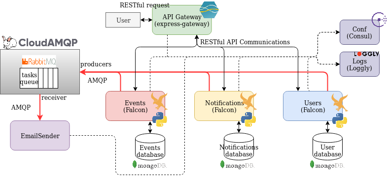
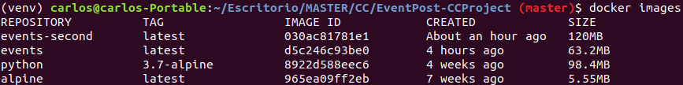
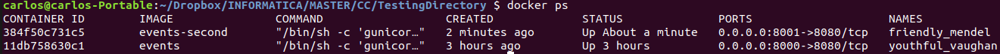
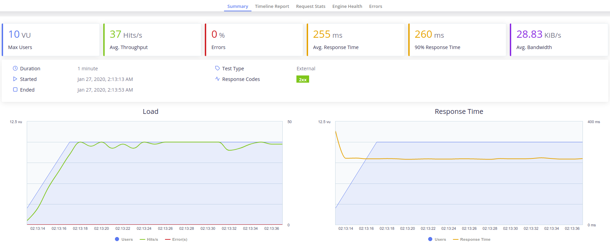
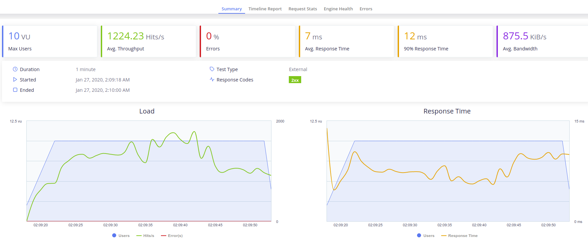

# Project documentation section.

### Abstract:
The idea for this project is to develop a microservices based application for the cloud.
It will provide a discovering and management system for social events along with the possiblility of programming email-based notification for the desired events as reminders.

## Requirements and Usage:

- Previous requirements: 
    - `Docker`
    - `Python 3.6 - 3.8`
- Install: 
    - `pip3 install invoke`
    - `invoke installDependencies`
- Build: 
    - `invoke buildContainers`
- Test: 
    - `invoke test`
    - `testContainers`
- Coverage: 
    - `invoke coverage`
- Run: 
    - `invoke runContainers` (starts containers) or `invoke runAWS` (virtual machines provisioning in AWS)

## Architecture:
As stated before, we will be using a microservices based architecture with one microservice per entity in the system and one as task dispatcher. The microservices needed arise from decomposing our system using Domain Driven Design subdomains. The microservices developed to achieve our goal are the following:
- Events: Stores events information and receives requests for managing events. 
- Notifications: Stores information relevant for the notifications and receives requests for managing them.
- Email-sender: Sends emails to the users when requested by other services. It will provide the functionality for sending the notification emails and other emails related to the system such as welcome emails for new accounts.

Addtionally we will use a service for user management.
- Users Management: Stores the users' information and receives requests for authentication and managing accounts. 

All of them will be addressed through a specific API Gateway. It will also be in charge of authenticating certain request to other microservices against the User management service.

A centralized system using Consul will take care of service discovery and configuration between microservices. There will be a centralized log system as well.

Finally, for queueing tasks to the Email-sender microservice a RabbitMQ instace will be deployed with the Email-sender as receiver. 

### Communication:

The majority of the communications will take place over HTTP. The user will be able to contact our microservices through the API Gateway RESTful API. The Gateway will route those messages to the User management, Events and Notifications microservices which will include a RESTful API for receiving messages.

Communication between the Email-sender and other microservices will be carried out using a RabbitMQ message broker implementing a queue and the AMQP protocol for message passing. The Email-sender will act as the receiver, taking messages from the queue and the other microservices will act as senders sending tasks to the queue.

### Database management:
In our system we will store the following data:
- Users data for authentication and user management (passwords, usernames, emails.)
- Events data (title, descriptions, date, time, place, topic).
- Notifications data (destination email, subject, content, scheduled time, event associated.)

In order to keep services independent, a Database-per-service architecture will be implemented. Each database will be private to its corresponding microservice. As there are no relation in our databases a NoSQL database will be used.

### Technologies:
- The __microservices__ will consist in the following:
    - Email-sender microservice will be implemented using NodeJS. This microservice is only intended for performing the task of sending emails and only communicates with the other system components through message broker. Therefore the only npm libreries needed for it are [amqplib](https://www.npmjs.com/package/amqplib) and [nodemailer](https://nodemailer.com/about/) which are widely known and easy to use.
    - The Users Management service and Events and Notification microservices will be implemented in Python. [Falcon](https://falconframework.org/) will be used as framework for working with HTTP RESTful requests and responses. It has been chosen for being a light-weight microframework written in Python that supports the REST architectural style. It is not suitable for serving HTML but this will not be a problem in our case. Our microservices have to send tasks over the AMQP protocol to a message broker, for this reason they will also use the library [pika](https://pypi.org/project/pika/) as it is designed for RabbitMQ brokers like the one that we are going to deploy.

- The __API Gateway__ will be deployed used [Express Gateway](https://www.express-gateway.io/) which uses NodeJS. It is one of the few API Gateways for NodeJS, it is simple, for general purpose and allows the fast development lifecycle required in agile projects.

- Our centralized system for __configuration and service discovery__ across microservices will be established using [Consul](https://www.consul.io/discovery.html) because it is designed especially for this task, it is easy to deploy and configure and it comes almost ready to work. It also supports containers.  

- For our __logging system__ we will be using [Loggly](https://www.loggly.com/), a SaaS platform that will provide an already deployed realiable enviroment for our logs. 

- For the __message broker__ we will use [CloudAMQP](https://www.cloudamqp.com/). It is a platform that offers RabbitMQ instances as a service and it also has free plans that cover our needs for this project. This will save us work when developing the deployment chain.

- As the __storage__ needed for our microservices consist on NoSQL databases, some of them with a consisten amount of data, we are going to use [MongoDB](https://www.mongodb.com/es). MongoDB is a document database which pairs quite well with the information needed to store events where we need a single object and joins will not going to be used. The [pymongo](https://api.mongodb.com/python/current/) library will be used in our python microservices so they can connect with the database.

#### Arquitecture basic diagram.

## User stories:
The user stories that came up are the following.
- As user I want to create an account so I can keep track of the events I like.
- As user I want to be able to look for events related to my likes, events near me so I do not have to make a trip and events that are going to take place next week so I can make a schedule.
- As an administrator I want to be able to manage events information so in case an event date change a can edit it.
- As user I would like to set reminder notifications of events I like and schedule a certain date and time for them so in case I have to buy tickets I can do it on time.
- As user I would like to be able to change the mail where the remainder notification is going to be send.  
- As user I want to receive notification on time so I do not mess up my schedule and add delay notifications in case I change my mind.  

##### System functionality:
The features found out in the user stories for each microservice have been mapped into milestones and its corresponding issues (links to milestones below). 
- [Events](https://github.com/carlos-el/EventPost-CCProject/milestone/6):
    -   Get events related to a topic.
    -   Get events happening in a range of time.
    -   Get events happening in a specified location.
    -   Get information of a certain event.
    -   Create an event.
    -   Delete an event.
    -   Edit an event.
- [Notifications](https://github.com/carlos-el/EventPost-CCProject/milestone/7):
    -   Create a notification.
    -   Get the notifications related to an account.
    -   Update the scheduled date and time of a notification.
    -   Update the email where a notification is going to be send.
    -   Delete a notification. 
- [Email-sender](https://github.com/carlos-el/EventPost-CCProject/milestone/8): 
    -   Send email notifications.

Additionally the User management system will include the following features.
[Users Management](https://github.com/carlos-el/EventPost-CCProject/milestone/5):
    -   Create an account.
    -   Delete an account.
    -   Update email.
    -   Add a secondary email to an account.

This features has been mapped into milestones and issues.

## Continuous integration:
This section will describe the continuous integration system and tools, the testing and the building tool used.

### Testing:
A series of tests have been develop for our microservices. For testing the code the python library [pytest](https://docs.pytest.org/en/latest/contents.html) has been used. Another library, [coverage](https://coverage.readthedocs.io/en/v4.5.x/), has been also used for generating the testing coverage reports. Finally this information is uploaded to [CodeCov](https://codecov.io/) using its command tool.

For implementing integration tests for the REST services we have used pytest and a Falcon feature, a [testing client](https://falcon.readthedocs.io/en/stable/api/testing.html) that lets us send requests to the server without starting it.

Once we have created our test we can execute them, check the tests coverage, generate a report file and upload the report to CodeCov.

### Task tool:
buildtool: tasks.py

As we are using python the task tool selected has been [invoke](http://www.pyinvoke.org/). It uses the file [tasks.py](./tasks.py) for declaring tasks. In each task we can declare a series of cammands to execute. Finally we can do `invoke <task>` to carry out the desired task.

We created tasks for updating the dependencies file (requirements.txt), installing new dependencies, running tests, building running and testing microservices containers, etc. All tasks can be found in the file [tasks.py](./tasks.py).

### CI tools:

For continuous integration we have used two different tools, Travis-CI and Circle-CI. For both of them to work we need to link our GitHub account to the services, allow access to the our repository and add a configuration file.

For TravisCI the file used is [.travis.yml](./.travis.yml). There we can specify the laguage versions to test and the commands for setting it up. In previous test we found out that the system does not work below python3.5 due to dependencies.

For CircleCI the file used is [config.yml](./.circleci/config.yml). The concept is the same as in the travis file but with a different sintax. More information about both files can be found in their links.

## Docker
The base image choosen for the containers has been [bitnami/minideb](https://hub.docker.com/r/bitnami/minideb/), mainly because its ease of use, more information about this in the following section.

We have until now 2 microservices so we will be running 2 containers. Dockerfiles for creating them are the following, they include explaining commentaries. [Events Dockerfile](./Events.dockerfile). [Notifications Dockerfile](./Notifications.dockerfile)

A docker-compose file has been created for speeding up container management in development [docker-compose file](./docker-compose.yml). When the docker-compose file is executed using `docker-compose up -d` with success both microservices will be ready to receive requests.

#### Containers:
The link to the DockerHub containers is the following:

Contenedor: https://hub.docker.com/r/carlosel/eventpost-cc

Additionally the the containers have been uploaded to GitHub packages in the following URLs:

- https://github.com/carlos-el/EventPost-CCProject/packages/63507

- https://github.com/carlos-el/EventPost-CCProject/packages/63509

Both registries auto-update when there is a push to GitHub thanks to travis.

## Deployment:
### Heroku:
The Events microservice has been deployed to Heroku. The steps followed can be found in the [official documentation](https://devcenter.heroku.com/articles/git#prerequisites-install-git-and-the-heroku-cli), basically we just created a heroku app using the CLI, specify that it will be a containerized app and pushed our code to heroku. Additionally we have created a [heroku.yml](/heroku.yml) and enabled autodeploy for our app in order re-deploy the app everytime we make a push to our repository.

Link to the deployed app:
- https://eventpost.herokuapp.com/events

This service can be populated using the command `invoke populateHerokuEventsApp` available at [tasks.py](/tasks.py).

### Deployment to AWS EC2 using Ansible for provisioning:
In order to deploy our microservices using virtual machines we have used AWS EC2 service as well as Ansible for provisioning our instances.
#### Setting up AWS CLI and Ansible:
There are several steps that we have to complete for setting up our deployment environment:
- First we have to install Ansible and AWS CLI. We installed Ansible using [pip](https://docs.ansible.com/ansible/latest/installation_guide/intro_installation.html#installing-ansible-with-pip) as described in the official documentation as well as the [AWS CLI](https://docs.aws.amazon.com/es_es/cli/latest/userguide/install-cliv2-linux-mac.html).
- The next step is configuring the AWS CLI to work with Ansible. In order to allow Ansible to use AWS CLI capabilities we have to let it read the AWS credentials using a safe method. An easy way to do that is with ['ansible-vault'](https://docs.ansible.com/ansible/latest/user_guide/vault.html). 
    - First we create a encrypted file with `ansible-vault create foo.yml`. 
    - Then we can simply set our encrypted variables in the file with `env EDITOR=nano ansible-vault edit provision/group_vars/all/pass.yml`. After that we will have access to our credentials in Ansible scripts (previous authenticatio via pasword before executing the scripts).
- Another requirement for Ansible to work with AWS is to have the AWS python SDK (boto and boto3) installed. They can be added wasily with pip.

After we have completed all these steps Ansible will be ready to work with the AWS module.

#### Use of Ansible:
Once the development environment is ready we can create an Ansible file structure for provisioning. It will live in the provision folder. In our case we have choosen to use Ansible not only to provide the instances but to instanciate them. Here is what we have done:

- Firstly we have used ansible-vault for storing AWS credentials in a file that is not presdent in the repository. More information in the ['Setting up AWS and Ansible section'](/docs/index.md#setting-up-aws-cli-and-ansible).
- We have defined a __[configuration file](/ansible.cfg)__ in the root directory so it can be found by Ansible. Here we just state the directory of the ansible host inventory and the unkown hosts policy.
- Then we have created the __[hosts inventory file]__(/provision/hosts). It contains an empty host group where the EC2 instances created will be added at runtime. It also defines the private key to use when connecting to them and the default user.
- Two __tasks__ files have been created. One for [installing docker](/provision/roles/eventpost/tasks/install_docker.yml) in the instances and the other for [terminating instances](/provision/roles/eventpost/tasks/terminate_eventpost_instances.yml) previously created (EventPost instances will be marked using tags). Both of them are part of a __role__ defined in [main.yml](/provision/roles/eventpost/tasks/main.yml). It will be used in the provisioning playbook.
- The Ansible __playbook__ is the most interesting part. The full file with annotations can be found [here](/provision/provision.yml). Inside it we use 3 hosts directives as described below:
    - The first host directive:
        - Uses localhost (our machine).
        - Terminates old EventPost instances is there is any.
        - Starts two new instances with specific tags assigned so we can identify them later.
        - Adds the newly created instances DNS to an empty host group.
        - Waits until the instances can be addressed throught SSH.
    - The second host directive: 
        - Uses the in-memory host group created in by the localhost when starting the instances. also uses a user with privileges to interact with the instances.
        - Installs Docker in the virtual machines belonging to the host group.
        - Pulls a docker image to the instance (a different one depending on the microservice. Our Events instance will receive the events image, etc).
        - Starts a container using the previously pulled image (basically starts the service).
    - The third host directive:
        - Uses localhost again.
        - Checks the microservices ports until they are available.
        - Populates each microservice database with data.

### Describing the instances:
AWS EC2 service offers a good amount of configurations for its instances. The configuration that we have choosen for our microservices is the following:
- Instance type (hardware): We have decided to use __t2.xlarge__, it offers a decent performance (tested in the next section) for a good price (Actually, for development and not wasting money we will be using t2.micro which is included in the free tier usage of the AWS EC2 service).

- Image: As image we will be using UbuntuServer 18.04. By default, AWS does not offer many images for educational accounts and some of them are for specific use. Between the different options Ubuntu Server is a reliable and known to the developer. 
- Security group: In EC2 instances use a security group for managing which ports are open and who can address them. Using the AWS EC2 GUI conosle we have created a group that opens port 22 (SSH), 80 (HTTP) and 443 (HTTPS) to the world.
- Region: region where the instances should be created. For the educational account only 'us-east' is available. It would have been nice to deploy the services closer to Spain for latency but we had no choice.

## Performance:
### Performance testing:
Performance testing has been carried on using Taurus with Jmeter as executor. A [taurus script](/tests/performance/performance_testing.yml) has been creted for testing both microservices. The script contains auto-explainatory annotations but basically it consist of the following:
- Two scenarios for each microservice:
    - GET-Scenario: Performs one GET request to obtain all resources in the system, gets 5 ids of the resources obtained and performs a GET request to each of this specific ids. In total it contains a cycle of 6 GET request to hte microservice.
    - POST-PUT-DELETE Scenario: Makes a POST request to the microservice creating a new resource, then it retrieves the id of the new resource created abd performs a PUT and a DELETE request to this specific resource previously created. It Contains acycle of 3 requests, POST, PUT and DELETE, in taht order.   
- Taurus cache simulation is disabled for all scenarios so it does not give a better performance than it should.
- The execution section uses both scenarios of only one microservice at the same time trying to simulate a real load.
    - For the GET scenario we have used a throughput of 3000 and a concurrency of 7. For the POST-PUT-DELETE scenario we have used a throughput of 1000 and a concurrency of 3. 
        - In Taurus throughput and concurrency of scenarios executed at the same time stacks so finally we get a total throughput of 4000 (being 75% GET requests and 25% a mix of POST, PUT and DELETE requests) with a concurrency of 10. It tries to simulates the normal schema load that this microservice could receive in production. Notice that the throughput is set to 4000 so this does not become a limitation for the test.
    
#### Optimization:
In order to achieve a good performance two actions have been performed:
- Gunicorn workers at server start up have been set to 7 (this is done in the [dockerfile](/Events.dockerfile) CMD command) in an attempt to be able to handle 10 cocache ncurrent user requests.
- A cache module called [falcon-caching](https://falcon-caching.readthedocs.io/en/latest/) has been added to the Falcon web framework in order to improve requests prosecution. It just requires setting the type of cache desired in the app module and adding a decorator to the resources classes.

#### Results:
Results obtained from performing this tests over the Events microservice in a local container are the following:

As we can see for 10 concurrent users and the scheme of requests explained previously the Events microservice can handle up to 2000 RPS with a very low response time and no errors.

In the case of the Notifications Microservice the result are very similar. After all both microservice manage very light resources.

Finally to test the service limits concurrency has been incremented several times.
The image below shows how with 100 concurrent users the RPS decrese is irrelevant, however the performance decrease in the response time is remarkable.

The microservice starts to fail with 200 concurrent users and a combined throughput of 4000 from both scenarios. Also tests with 100 concurrent users and a combined throughput of 10000 shows a decrese of the RPS to 1600.

### Images  performance testing:
Load performance measurements between containers using the Event microservice with 2 different base images (alpine and python:3.7-alpine) has been done. For this purpose we have used the tool [Taurus](https://gettaurus.org/) and used a reference [script with some modifications](/tests/performance/taurus_script.yml). Explanation about the script can be found in the in-line comments of the file. 

The tests have been performend in local using a Intel Core i7-4790 CPU @ 3.60GHz × 8 CPU. 

After pulling the required base images we have used this [dockerfile](/Dockerfile.events), changing only the FROM directive between alpine and python:3.7-alpine and deleting the python install line. Making this we creates 'events' image, with alpine and 'events-second' with 'python:3.7-alpine'.

As we can see the image created with 'python:3.7-alpine' doubles the size of the other which is undesirable.
Now we will run the microservice and perform a load test in both containers.

Measurements for 'events' image (base image: alpine):
 measurements")
Measurements for 'events-second' image (base image: python:3.7-alpine):
 measurements")

For the same load we can see that the container using alpine as base image performs slightly better in terms of RPS and also has a slightly lower response time. With this metrics we can then assure than the 'alpine' base image is better for our project.

Later on we required the installation of MongoDB in the container. Alpine4.0 does not supports MongoDB and a lot of problems arise when trying to install and execute it so we changed to a similar debian image, 'bitnami/minideb' it is not as small as alpine (67MB) but supports all the applications we need.

### AWS EC2 Instances performance testing:
For testing the performance of the microservices we have used __t2.xlarge__ EC2 instances and the Taurus scripts created for the previous milestone.

We have tested executing the script from our local computer addressing the instance and executing the script in the same machine (instance) the service is deployed on.
- Testing from local computer to the instances:
This works just as a demostration because actually what we are testing, more than the capabilites of the instance or the optimization made to the services, is how fast can the network send our request. We dont really know how many request can the service maintain before overloading, we just know how many request we can send and receive in a certain amount of time.
However is a good way fo testing latency.

As we can see the number of requests per second is awful, nonetheless, the latency of the request is not that bad having into account the location of the instances (us-east), but obviously it could be better if we could choose a closer region to deploy.

- Testing from inside the instances:
This test can actually report information of how can the service behave under a real work load as it has to serve a lot more request than in the previous test. 
To perform this test we have connected to the instance using SCP and tranferred our Taurus script. Then throught SSH we have installed Java and bzt and finally we have executed the test using bzt.
The results are the following.

As we can see, even with the the decay in performance that the machine could experiment by executing the test and serving the request, the results are quite good. We get 1224 RPS so we can say that the machine can handle a serious amount of load.
