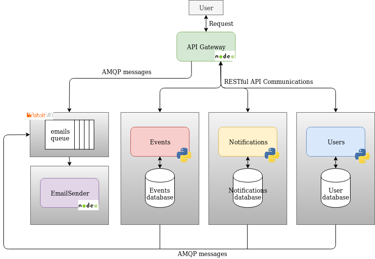

# Project documentation section.
### Abstract:
We will develop a microservices based application using the cloud.
It will provide an event discovery and management system along with the possibility of programming email-based notification for the desired events.

### Architecture:
As stated before, we will be using a microservices based architecture. The microservices needed arise from decomposing our system using Domain Driven Design subdomains. The services developed to achieve our goal are the following:
- Authentication: Stores the users' information and receives requests for authentication and managing accounts.
- Events: Stores events information and receives requests for managing events. 
- Notifications: Stores information relevant for the notifications and receives requests for managing them.
- Email-sender: Sends emails to the users when requested by other services. 

All of them will be addressed through a specific API Gateway.

### Database management:
In our system we will store the following data:
- Users data for authentication (passwords, usernames, emails, etc.)
- Events data (titles, descriptions, dates, etc).
- Notifications data (destination email, content, subject, etc.)

In order to keep services independent, a Database-per-service architecture will be implemented. Each database will be private to its corresponding microservice.

### Technologies:
The programming language chosen for the Authentication, Events and Notification services will be Python. NodeJS will be used for implementing the Email-sender and the API Gateway.
Communication with the API Gateway will be done with RESTful and the microservices will contact the Email-sender service with asynchronous requests using the AMQP protocol and a queue manager middleware like RabbitMQ.

 More information will be given as the course goes on.