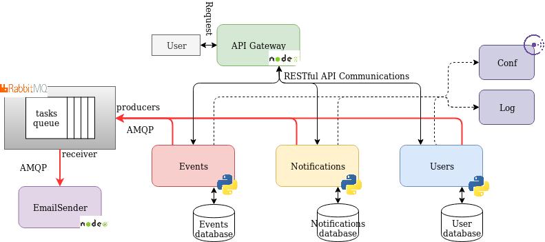

# Project documentation section.

### Abstract:
The idea for this project is to develop a microservices based application for the cloud.
It will provide a discovering and management system for social events along with the possiblility of programming email-based notification for the desired events as reminders.

### Architecture:
As stated before, we will be using a microservices based architecture with one microservice per entity in the system and one as task dispatcher. The microservices needed arise from decomposing our system using Domain Driven Design subdomains. The microservices developed to achieve our goal are the following:
- Events: Stores events information and receives requests for managing events. It will provide the functionality for:
    -   Get information of events.
    -   Get information of a certain event.
    -   Create an event.
    -   Delete an event.
- Notifications: Stores information relevant for the notifications and receives requests for managing them.
    -   Get the scheduled notifications related to an account.
    -   Create a new email notification with an associated event.
    -   Delete a notification. 
- Email-sender: Sends emails to the users when requested by other services. It will provide the functionality for sending the notification emails and other emails related to the system such as welcome emails for new accounts.

Addtionally we will use a service for user management.
- Users Management: Stores the users' information and receives requests for authentication and managing accounts. It will provide the functionality for:
    -   Create an account.
    -   Delete an account.
    -   Authenticate a set of credentials.

All of them will be addressed through a specific API Gateway. It will also be in charge of authenticating certain request to other microservices against the User management service.

A centralized system using Consul will take care of service discovery and configuration between microservices. There will be a centralized log system as well.

Finally, for queueing tasks to the Email-sender microservice a RabbitMQ instace will be deployed with the Email-sender as receiver. 

### Communication:

The majority of the communications will take place over HTTP. The user will be able to contact our microservices through the API Gateway RESTful API. The Gateway will route those messages to the User management, Events and Notifications microservices which will include a RESTful API for receiving messages.

Communication between the Email-sender and other microservices will be carried out using a RabbitMQ message broker implementing a queue and the AMQP protocol for message passing. The Email-sender will act as the receiver, taking messages from the queue and the other microservices will act as senders sending tasks to the queue.

### Database management:
In our system we will store the following data:
- Users data for authentication and user management (passwords, usernames, emails.)
- Events data (title, descriptions, date, time, place, topic).
- Notifications data (destination email, subject, content, scheduled time, event associated.)

In order to keep services independent, a Database-per-service architecture will be implemented. Each database will be private to its corresponding microservice. As there are no relation in our databases a NoSQL database will be used.

##### Arquitecture basic diagram.

 More information will be given as the course goes on.